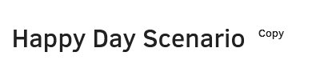

Script creates convenient button to copy algorithm from bookkit to code.
## Usage
Install [script](./algo2comment.js) using [tampermonkey](https://www.tampermonkey.net/) browser plug-in.

Copy button is created next to the algorithm header.

Note that only displayed steps are copied. If you want to copy the whole algorithm, expand all steps first (e.g. using "Expand All" option in algorithm context menu).